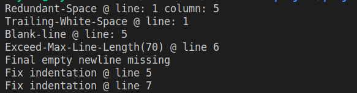

# Capstone-Ruby-Linter
> In this project I have built a linter for ruby using ruby programming language.
> This linter will check for style issues in your ruby code

 

# Features

1. Detects indentation issues 
2. Detects trailing space
3. Detects blank lines 
4. Detects redundant spaces
5. Detects if maximum line length is exceeded
6. Detects if the file has a final empty newline

# Good and Bad Practices

## Indentation

> Use at least two spaces per indentation level 

### Good

```
def some_method
  do_something
end
```

### Bad

```
def some_method
do_something
end
```

## Trailing space

> No space should be included at line endings

## Blank lines

> No blank lines should be included in between codes
> But add one blank line after methods 

### Good

```
def some_method
  do_something
end

def other_method
  do_something
end
```

### Bad

```
def some_method
  
  do_something
end
```

## Maximum line length

> No lines should contain more than 70 characters or spaces

### Good

```
print 'First, and foremost - numerous studies have shown that'
print 'humans read much faster vertically and very long lines'
print 'of text impede the reading process.'
```

### Bad

```
print 'First, and foremost - numerous studies have shown that humans read much faster vertically and very long lines of text impede the reading process.'
```

## Redundant spaces

> No more than one space should be included between 'def' and method name

### Good

```
def some_method
  do_something
end

```

### Bad

```
def   some_method
  do_something
end
```

## Final empty new line

> A file should always end with an empty new line

### Good

```
class Game
  some_code
end

```

### Bad

```
class Game
  some_code
end
```

## Requirements

- RUBY

## How to use the linter

- navigate to your desired directory in your local machine
- clone the repo : `git@github.com:ershadul1/Capstone-Ruby-Linter.git`
- change directory into above cloned directory : `cd Capstone-Ruby-Linter`
- navigate to bin directory
- save your test file inside the bin folder
- now run the following command to check for linter errors on your test file
- `ruby main.rb filename.rb`
- Now you will get reports about the errors

## Authors

 👤 **Rayhan**

- Github: [@ershadul1](https://github.com/ershadul1)
- Twitter: [@ErshadulRayhan](https://twitter.com/ErshadulRayhan)
- Linkedin: [ErshadulRayhan](https://www.linkedin.com/in/ershadul-hakim-rayhan-a5a17649/)
- Email:  ershadul.rayhan@gmail.com

## Contributing

- To contribute to this project:
- Fork this repository & clone locally.
- Create an upstream remote and sync your local copy.
- create a new branch.
- Push your code to your origin repository.
- Create a new Pull Request .

## Show your support

Give a ⭐️ if you like this project!
​
## Acknowledgments

- Microverse
