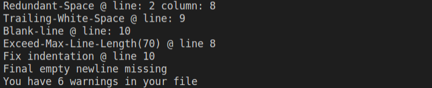

# Capstone-Ruby-Linter
> In this project I have built a linter for ruby using ruby programming language.
> This linter will check for style issues in your ruby code.

 

# Features

1. Indentation
2. Trailing spaces
3. Blank lines 
4. Redundant spaces
5. Maximum line length
6. Final empty line

# Good and Bad Practices

## Indentation

> Use two spaces per indentation level 

### Good

```
def some_method
  do_something
end
```

### Bad

```
def some_method
    do_something
end
```

## Trailing Spaces

> No space should be added at line endings.

## Blank Lines

> No blank lines should be included in between codes.
> One blank line can be added after methods.

### Good

```
def some_method
  do_something
end

def other_method
  do_something
end
```

### Bad

```
def some_method
  
  do_something
end
```

## Maximum Line Length

> No lines should contain more than 70 characters or spaces.

### Good

```
print 'First, and foremost - numerous studies have shown that'
print 'humans read much faster vertically and very long lines'
print 'of text impede the reading process.'
```

### Bad

```
print 'First, and foremost - numerous studies have shown that humans read much faster vertically and very long lines of text impede the reading process.'
```

## Redundant Spaces

> No more than one space should be included in between words.

### Good

```
def some_method
  do_something
end

```

### Bad

```
def   some_method
  do_something
end
```

## Final Empty Line

> A file should always end with an empty line.

### Good

```
class Game
  some_code
end

```

### Bad

```
class Game
  some_code
end
```

## Requirements

- RUBY

## How to use the linter

- Clone the repo: `git clone git@github.com:ershadul1/Capstone-Ruby-Linter.git`
- Change directory to the cloned directory: `cd Capstone-Ruby-Linter`
- Navigate to bin directory: `cd bin`
- Save your test file inside the bin folder
- Run `ruby main.rb filename.rb` to check for linter errors in your test file

## Live Demo

- Go to this [link](https://repl.it/@Ershadul/Capstone-Ruby-Linter#bin/input.rb).
- Add your code inside `bin/input.rb` file.
- Press the run button.

## Authors

 👤 **Ershadul Hakim Rayhan**

- Github: [@ershadul1](https://github.com/ershadul1)
- Twitter: [@ErshadulRayhan](https://twitter.com/ErshadulRayhan)
- Linkedin: [ErshadulRayhan](https://www.linkedin.com/in/ershadulrayhan/)
- Email:  [ershadul.rayhan@gmail.com](mailto:ershadul.rayhan@gmail.com)

## Contribution
There are two ways of contributing to this project:

1.  If you see something wrong or not working, please check [the issue tracker section](https://github.com/ershadul1/Capstone-Ruby-Linter/issues), if that problem you met is not in already opened issues then open the issue by clicking on `new issue` button.

2.  If you have a solution to that, and you are willing to work on it, follow the below steps to contribute:
    1.  Fork this repository
    1.  Clone it on your local computer by running `git clone git@github.com:ershadul1/Capstone-Ruby-Linter.git` __Replace *ershadul1* with the username you use on github__
    1.  Open the cloned repository which appears as a folder on your local computer with your favorite code editor
    1.  Create a separate branch off the *master branch*,
    1.  Write your codes which fix the issue you found
    1.  Commit and push the branch you created
    1.  Raise a pull request, comparing your new created branch with our original master branch [here](https://github.com/ershadul1/Capstone-Ruby-Linter)
## Show your support

Give a ⭐️ if you like this project!
​
## Acknowledgments

- Microverse
